<p align="center">
  
</p>

<h3 align="center">
  🚀 Enterprise-Grade ML Dashboard | 📊 Interactive Visualization | 🎯 98% Accuracy
</h3>

<p align="center">
  
  
  
  
  
  
</p>

<p align="center">
  
  
  
</p>

<p align="center">
  <a href="https://churn-prediction-data.streamlit.app/">🔗 Live Demo</a> •
  <a href="#-features">Features</a> •
  <a href="#-installation">Installation</a> •
  <a href="#-usage">Usage</a> •
  <a href="#-model-performance">Performance</a>
</p>

---

## 📋 Table of Contents

- [Overview](#-overview)
- [Business Problem](#-business-problem)
- [Project Workflow](#-project-workflow)
- [System Architecture](#️-system-architecture)
- [Features](#-features)
- [EDA Insights](#-eda-insights)
- [Model Performance](#-model-performance)
- [Installation](#-installation)
- [Usage](#-usage)
- [Tech Stack](#️-tech-stack)
- [Future Enhancements](#-future-enhancements)
- [Author](#-author)

---

## � Live Demo

<p align="center">
  <a href="https://churn-prediction-data.streamlit.app/" target="_blank">
    
  </a>
</p>

<p align="center">
  <a href="https://churn-prediction-data.streamlit.app/">
    
  </a>
  
  
</p>

<table align="center">
  <tr>
    <td align="center">
      <h3>🔗 Application URL</h3>
      <a href="https://churn-prediction-data.streamlit.app/">
        <code>https://churn-prediction-data.streamlit.app/</code>
      </a>
    </td>
  </tr>
</table>

<details>
<summary><b>📸 Dashboard Preview (Click to Expand)</b></summary>
<br>

| 🏠 Dashboard | 📊 EDA Explorer |
|:---:|:---:|
| KPI Cards, Churn Distribution | Correlation Heatmap, Distributions |

| 🎯 Churn Predictor | 🧠 Model Insights |
|:---:|:---:|
| Input Form, Confidence Gauge | 98% Accuracy, Feature Importance |

</details>

---

## �🎯 Overview

**Telecom Churn Analytics** is a comprehensive machine learning solution that predicts customer churn with **98% accuracy** using XGBoost. The project features an **interactive Streamlit dashboard** with:

- 📊 Real-time KPI monitoring
- 🔍 Interactive EDA visualizations
- 🎯 Live churn prediction
- 🧠 Model insights & feature importance
- 🌓 Dark/Light theme toggle
- 📁 Custom dataset upload

> **Business Impact**: Enables telecom companies to identify at-risk customers early, implement targeted retention strategies, and reduce revenue loss from customer churn.

---

## 💼 Business Problem

Customer churn is one of the most significant challenges facing the telecommunications industry:

| Metric | Impact |
|--------|--------|
| 💰 **Annual Revenue Loss** | $136 billion worldwide |
| 📉 **Average Churn Rate** | 15-25% annually |
| 💵 **Cost to Acquire New Customer** | 5-25x more than retention |
| ⏱️ **Customer Lifetime Value Loss** | Thousands per churned customer |

### 🎯 Project Goals

1. **Predict** customers likely to churn before they leave
2. **Identify** key factors driving customer churn
3. **Enable** proactive retention strategies
4. **Reduce** revenue loss through early intervention

---

## 🔄 Project Workflow

```mermaid
flowchart LR
    subgraph Data["📥 Data Collection"]
        A[("📊 Telecom Dataset<br/>3,333 Customers")]
    end
    
    subgraph Preprocessing["🔧 Preprocessing"]
        B["🧹 Data Cleaning"]
        C["📈 Feature Engineering"]
        D["🔢 Encoding"]
    end
    
    subgraph Analysis["🔍 Analysis"]
        E["📊 EDA"]
        F["📉 Statistical Analysis"]
    end
    
    subgraph Modeling["🤖 ML Pipeline"]
        G["⚖️ Train-Test Split"]
        H["🎓 Model Training"]
        I["📏 Hyperparameter Tuning"]
    end
    
    subgraph Evaluation["✅ Evaluation"]
        J["📊 Metrics Calculation"]
        K["🎯 Confusion Matrix"]
    end
    
    subgraph Deployment["🚀 Deployment"]
        L["💾 Model Export"]
        M["🖥️ Streamlit Dashboard"]
        N["☁️ Cloud Deploy"]
    end
    
    A --> B --> C --> D --> E --> F --> G --> H --> I --> J --> K --> L --> M --> N
    
    style A fill:#00d4ff,color:#1a1a2e
    style M fill:#ff4b4b,color:#fff
    style N fill:#00ff88,color:#1a1a2e
```



---

## 🏗️ System Architecture

```mermaid
flowchart TB
    subgraph Frontend["🖥️ Frontend - Streamlit Dashboard"]
        UI["Multi-Page UI"]
        Theme["🌓 Theme Engine"]
        Charts["📊 Plotly Charts"]
    end
    
    subgraph Backend["⚙️ Backend - Python"]
        DataLoader["📁 Data Loader"]
        Preprocessor["🔧 Preprocessor"]
        ModelEngine["🤖 XGBoost Engine"]
        Analytics["📈 Analytics Engine"]
    end
    
    subgraph Storage["💾 Storage"]
        Dataset[("📊 CSV Dataset")]
        Model[("🧠 Trained Model<br/>.joblib")]
    end
    
    subgraph Pages["📄 Dashboard Pages"]
        P1["🏠 Dashboard Overview"]
        P2["📊 EDA Explorer"]
        P3["🎯 Churn Predictor"]
        P4["🧠 Model Insights"]
        P5["👥 Customer Analytics"]
        P6["⚙️ Settings"]
    end
    
    UI --> DataLoader
    UI --> ModelEngine
    DataLoader --> Dataset
    ModelEngine --> Model
    Preprocessor --> Analytics
    Analytics --> Charts
    
    UI --> P1
    UI --> P2
    UI --> P3
    UI --> P4
    UI --> P5
    UI --> P6
    
    style Frontend fill:#ff4b4b,color:#fff
    style Backend fill:#3776ab,color:#fff
    style Storage fill:#00d4ff,color:#1a1a2e
```



---

## ✨ Features

### 🏠 Dashboard Overview
- **Real-time KPIs**: Total customers, churn rate, revenue at risk
- **Interactive Charts**: Churn distribution, service call analysis
- **Key Insights**: Auto-generated business recommendations

### 📊 EDA Explorer
- **Correlation Heatmap**: Feature relationships
- **Distribution Plots**: Feature analysis by churn status
- **Box Plots**: Outlier detection and comparison
- **Plan Analysis**: International & voicemail plan impact

### 🎯 Churn Predictor
- **Interactive Form**: Enter customer details
- **Real-time Prediction**: Instant churn probability
- **Confidence Gauge**: Visual risk indicator
- **Action Recommendations**: Retention strategies

### 🧠 Model Insights
- **Performance Metrics**: Accuracy, Precision, Recall, F1
- **Feature Importance**: Top predictors visualization
- **Classification Report**: Detailed model analysis

### 👥 Customer Analytics
- **Segment Analysis**: Usage-based customer groups
- **Risk Distribution**: Churn probability across segments
- **Data Preview**: Explore raw customer data

### ⚙️ Settings
- **🌓 Dark/Light Theme**: Toggle UI theme
- **📁 Dataset Upload**: Load custom CSV datasets
- **🔄 Reset**: Restore default dataset

---

## 🔎 EDA Insights

Our exploratory analysis revealed critical churn indicators:

### 🔥 Key Findings

| Factor | Finding | Churn Impact |
|--------|---------|--------------|
| 📞 **Service Calls** | 4+ calls = 45%+ churn rate | 🔴 HIGH |
| 🌍 **International Plan** | Subscribers 3x more likely to churn | 🔴 HIGH |
| 💰 **Total Charge** | High spenders ($75+) churn more | 🟡 MEDIUM |
| ✉️ **Voicemail Plan** | Subscribers 40% less likely to churn | 🟢 PROTECTIVE |

### 📊 Churn Distribution

```
┌─────────────────────────────────────────┐
│  Retained Customers: 85.5% (2,850)      │ ███████████████████░
│  Churned Customers:  14.5% (483)        │ ███░░░░░░░░░░░░░░░░░
└─────────────────────────────────────────┘
```

### 🎯 High-Risk Customer Profile

<table>
  <tr>
    <td align="center" colspan="4">
      <h3>⚠️ High Churn Risk Indicators</h3>
    </td>
  </tr>
  <tr>
    <td align="center">
      <h4>📞 Service Issues</h4>
      <ul>
        <li>4+ support calls</li>
        <li>Unresolved complaints</li>
      </ul>
    </td>
    <td align="center">
      <h4>🌍 International Plan</h4>
      <ul>
        <li>Active subscriber</li>
        <li>High intl usage</li>
      </ul>
    </td>
    <td align="center">
      <h4>💰 High Charges</h4>
      <ul>
        <li>Above avg billing</li>
        <li>Price sensitivity</li>
      </ul>
    </td>
    <td align="center">
      <h4>📱 Usage Patterns</h4>
      <ul>
        <li>Declining usage</li>
        <li>Irregular patterns</li>
      </ul>
    </td>
  </tr>
</table>

---

## 🤖 Model Performance

### XGBoost Classifier Results

| Metric | Score | Description |
|--------|-------|-------------|
| **Accuracy** | 98% | Overall correct predictions |
| **Precision** | 99% | True positives / predicted positives |
| **Recall** | 87% | Churners correctly identified |
| **F1 Score** | 0.96 | Harmonic mean of precision & recall |

### 📊 Classification Report

```
              precision    recall  f1-score   support

   Stay (0)       0.98      1.00      0.99       566
   Churn (1)      1.00      0.87      0.93       101

   accuracy                           0.98       667
   macro avg      0.99      0.94      0.96       667
weighted avg      0.98      0.98      0.98       667
```

### 📈 Top Features by Importance


---

## 💻 Installation

### Prerequisites

- Python 3.10+
- pip package manager
- Git

### Quick Start

```bash
# 1. Clone the repository
git clone https://github.com/shashankphenomeno111/Data-science-Project-TELE-COMMUNICATION-.git

# 2. Navigate to project directory
cd Data-science-Project-TELE-COMMUNICATION--main

# 3. Create virtual environment (recommended)
python -m venv venv
source venv/bin/activate  # Linux/Mac
venv\Scripts\activate     # Windows

# 4. Install dependencies
pip install -r requirements.txt

# 5. Run the dashboard
streamlit run app.py
```

### 📦 Dependencies

```
streamlit          # Web framework
pandas             # Data manipulation
numpy              # Numerical computing
plotly             # Interactive visualizations
scikit-learn       # ML utilities
xgboost            # Gradient boosting model
joblib             # Model serialization
```

---

## 🚀 Usage

### Running the Dashboard

```bash
streamlit run app.py
```

The dashboard opens at `http://localhost:8501`

### Navigation

1. **🏠 Dashboard**: Overview with KPIs and charts
2. **📊 EDA Explorer**: Explore data patterns
3. **🎯 Churn Predictor**: Make predictions
4. **🧠 Model Insights**: Understand the model
5. **👥 Customer Analytics**: Deep dive into segments
6. **⚙️ Settings**: Upload data, change theme

### Making Predictions

1. Navigate to **🎯 Churn Predictor**
2. Enter customer details:
   - Day minutes & charges
   - International usage
   - Service calls count
   - Plan subscriptions
3. Click **🔮 Predict Churn Risk**
4. View probability gauge and recommendations

---

## 🛠️ Tech Stack

```mermaid
flowchart LR
    subgraph Languages
        Python["🐍 Python 3.10"]
    end
    
    subgraph ML["Machine Learning"]
        XGB["🌲 XGBoost"]
        SKL["📊 Scikit-Learn"]
    end
    
    subgraph Data["Data Science"]
        Pandas["🐼 Pandas"]
        NumPy["🔢 NumPy"]
    end
    
    subgraph Viz["Visualization"]
        Plotly["📈 Plotly"]
        Seaborn["🎨 Seaborn"]
    end
    
    subgraph Deploy["Deployment"]
        Streamlit["🖥️ Streamlit"]
        Cloud["☁️ Streamlit Cloud"]
    end
    
    Python --> ML
    Python --> Data
    Python --> Viz
    ML --> Deploy
    Data --> Deploy
    Viz --> Deploy
```



---

## 📁 Project Structure

```
📦 Telecom-Churn-Prediction
├── 📄 app.py                          # Main Streamlit dashboard
├── 📄 app1.py                         # Legacy simple predictor
├── 📓 TELE_COMMUNICATION (19).ipynb   # Analysis notebook
├── 📊 telecommunications_Dataset.csv   # Customer dataset
├── 🧠 xgb_churn_model.joblib          # Trained XGBoost model
├── 📋 requirements.txt                 # Python dependencies
└── 📖 README.md                        # Documentation
```

---

## 🔮 Future Enhancements

- [ ] 🔗 **API Integration**: RESTful API for predictions
- [ ] ⚡ **Real-time Scoring**: Stream processing for live data
- [ ] 👥 **Customer Segmentation**: K-means clustering
- [ ] 🔄 **Auto Retraining**: MLOps pipeline
- [ ] 🔌 **CRM Integration**: Salesforce/HubSpot connectors
- [ ] 📱 **Mobile App**: React Native dashboard

---

## 👤 Author

<h3 align="center">
  👋 Hi, I'm <b>Shashank R</b>
</h3>

<p align="center">
  <b>Data Scientist | Machine Learning Engineer | End-to-End Deployment Specialist</b>
</p>

<p align="center">
  
  
  
</p>

<p align="center">
  Passionate about building <b>real-world predictive ML models</b>, binary classification systems, <br>
  and <b>end-to-end product deployments</b> that solve actual business problems.
</p>

<br>

<p align="center">
  <a href="https://www.linkedin.com/in/shashankdatascientist/" target="_blank">
    
  </a>
  &nbsp;&nbsp;
  <a href="https://github.com/shashankphenomeno111" target="_blank">
    
  </a>
  &nbsp;&nbsp;
  <a href="https://www.kaggle.com/" target="_blank">
    
  </a>
</p>

<br>

<table align="center">
  <tr>
    <td align="center">
      
    </td>
    <td align="center">
      
    </td>
    <td align="center">
      
    </td>
  </tr>
</table>

---

<p align="center">
  
</p>

<p align="center">
  
</p>

<p align="center">
  
</p>

<p align="center">
  
</p>
